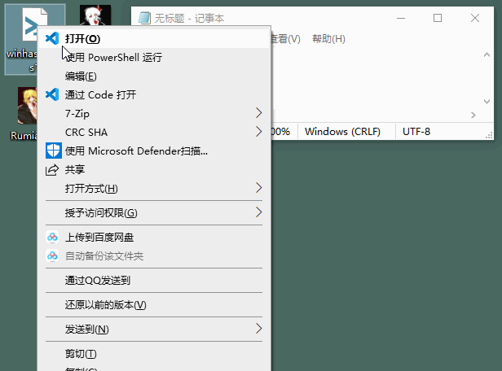

# WinHasher
A simple file hasher with GUI, which supports drag and drop. Written in Powershell without external module dependencies. 

Written by [Rumia \<rumia-san@outlook.com\>](mailto:rumia-san@outlook.com)

# Screenshot

# Features
1. Simple File Hasher with GUI
2. Written in Powershell without external modules
3. You could simply drag and drop files to the window!

# Usage
In powershell, just simply run `./winhasher.ps1`. Of cource, you couild right click the script and click "Run with Powershell" in the popup menu.

Command line arguments are supported as well. You could run `./winhasher.ps1 <filename1> <filename2> ...`, and then the files will be calculated.

Then you could drag and drop files to the window or click "Add File" button to add file.

If the file has been modified outside, just click the "Refresh Hash Values" button to recalculate the hash values.

## Key Bindings
* Press ESC to exit this script.
* Press CTRL-O to open file.
* Press F5 to refresh the hash values.
